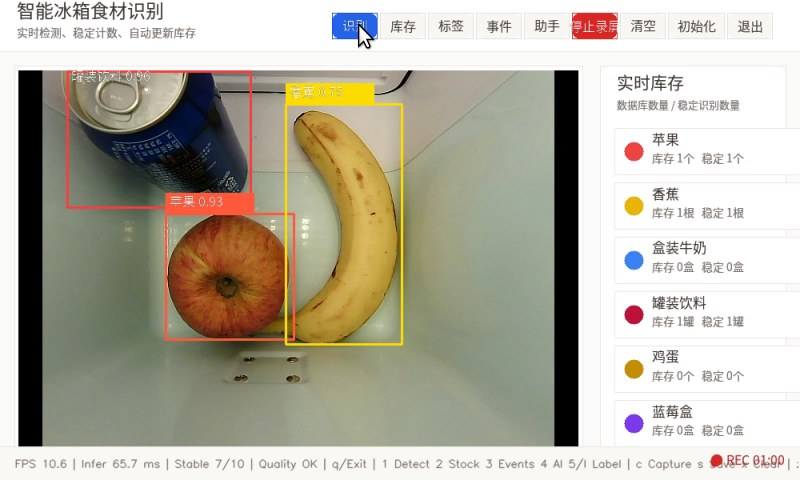
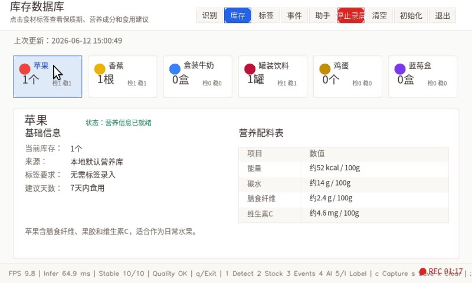
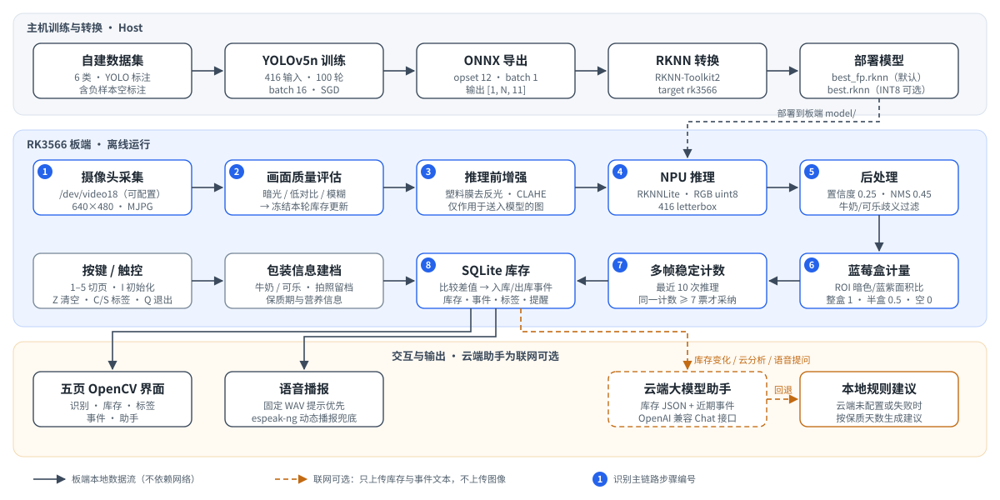
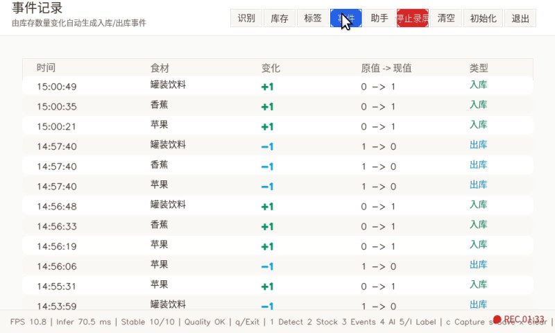
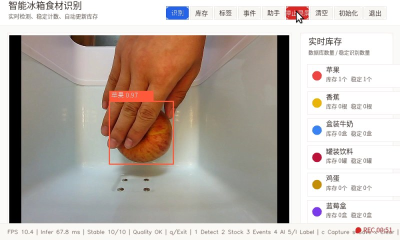
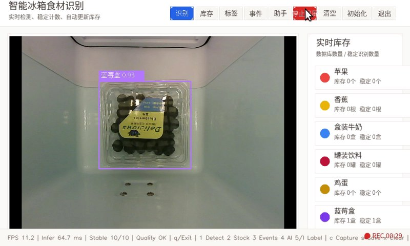
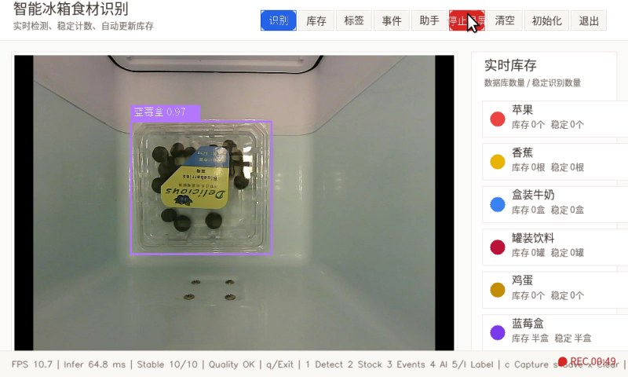
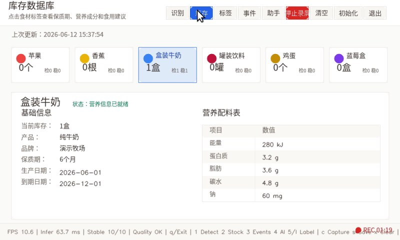
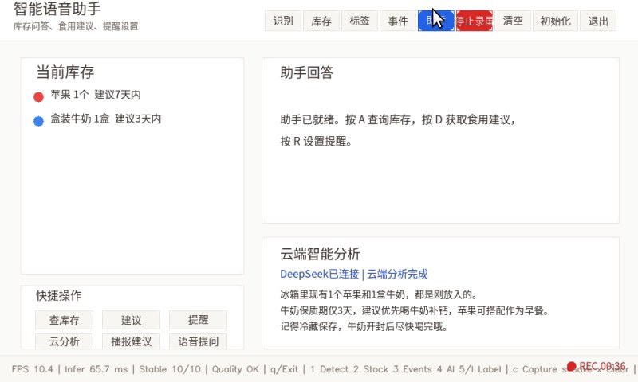
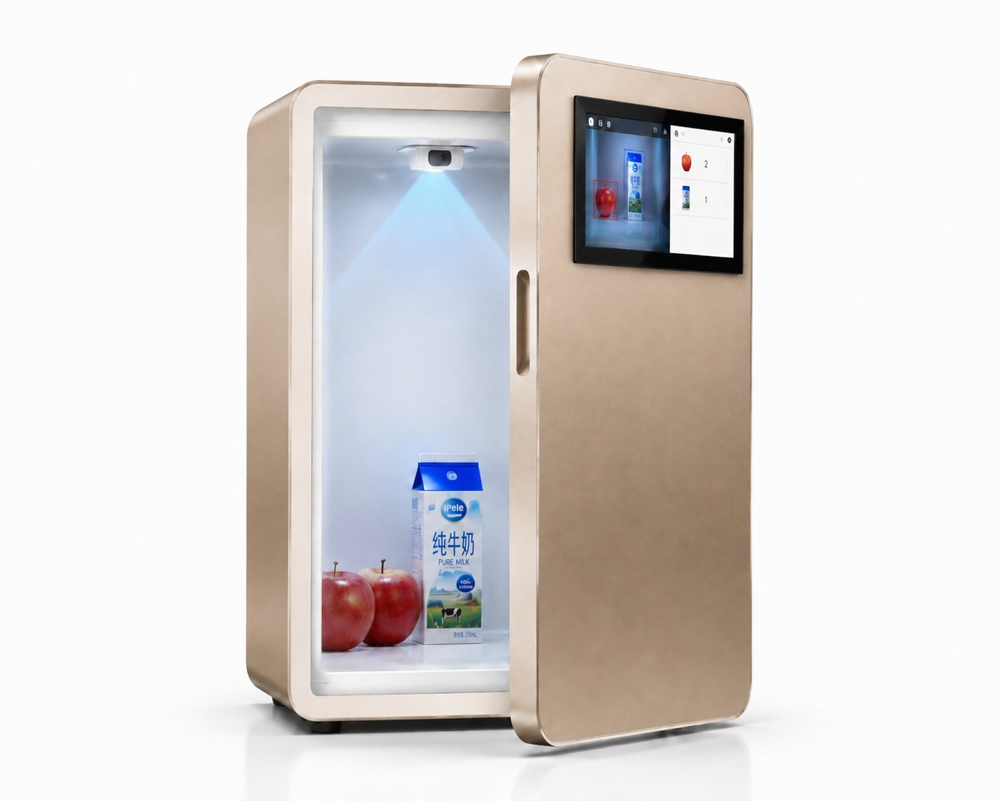

<div align="center">

# 智能冰箱食材识别与库存管理

### Fridge Mind RKNN · On-device Food Recognition & Inventory on RK3566

**摄像头看见冰箱里放了什么、拿走了什么：板端 NPU 实时识别，自动记账、语音播报，并由云端大模型给出饮食建议**


[项目简介](#项目简介) · [总体流程](#总体流程) · [功能展示](#功能展示) · [板端部署](#板端部署) · [模型训练](#模型训练) · [项目结构](#项目结构)

</div>

<table>
  <tr>
    <td width="50%" align="center">
      <a href="docs/assets/recognition.jpg"></a>
      <br><sub><b>识别页</b> · 多类食材同时检测，右栏实时显示库存数 / 稳定识别数</sub>
    </td>
    <td width="50%" align="center">
      <a href="docs/assets/inventory.jpg"></a>
      <br><sub><b>库存页</b> · 六类食材卡片，点开查看建议食用天数与营养信息</sub>
    </td>
  </tr>
</table>

---

## 项目简介

Fridge Mind RKNN 是一套运行在 **RK3566 开发板**上的智能冰箱食材管理系统。冰箱内的摄像头持续采集画面，
YOLOv5n 模型经 RKNN 转换后在 NPU 上推理，识别 **苹果、香蕉、盒装牛奶、罐装饮料、鸡蛋、盒装蓝莓** 六类食材；
多帧稳定计数确认数量变化后，系统自动写入 SQLite 库存、生成入库 / 出库事件并中文语音播报。
联网时，库存与近期事件会发送给云端大模型，生成简短的饮食建议并可一键播报。

<table>
  <thead>
    <tr><th width="160">能力</th><th>说明</th></tr>
  </thead>
  <tbody>
    <tr><td><strong>六类食材识别</strong></td><td>YOLOv5n · 416 输入，RKNNLite 调用 NPU 推理；板端完成置信度过滤、NMS 与牛奶 / 可乐易混类别过滤</td></tr>
    <tr><td><strong>多帧稳定计数</strong></td><td>最近 10 次推理中同一计数结果 ≥ 7 票才更新库存；暗光、低对比、模糊画面自动冻结本轮更新</td></tr>
    <tr><td><strong>蓝莓半盒估计</strong></td><td>在蓝莓盒检测框内统计果实面积占比，区分整盒、半盒与空盒</td></tr>
    <tr><td><strong>库存与事件</strong></td><td>SQLite 持久化库存、出入库事件、食材资料、食用提醒与包装信息</td></tr>
    <tr><td><strong>包装信息建档</strong></td><td>牛奶、可乐拍照留档，管理品牌、保质期、生产 / 到期日期与营养成分</td></tr>
    <tr><td><strong>中文语音</strong></td><td>30 条固定 WAV 提示优先播放，动态内容由 espeak-ng 合成</td></tr>
    <tr><td><strong>端云协同建议</strong></td><td>OpenAI 兼容 Chat 接口生成饮食建议；未联网时自动使用本地规则建议</td></tr>
    <tr><td><strong>五页触控界面</strong></td><td>识别 · 库存 · 标签 · 事件 · 助手，支持触控按钮与键盘快捷键</td></tr>
  </tbody>
</table>

## 总体流程

<p align="center">
  <a href="docs/assets/pipeline.svg"></a>
</p>

- **主机侧**：自建六类数据集训练 YOLOv5n，导出 ONNX（输出 `[1, N, 11]`），再用 RKNN-Toolkit2 转换为 `rk3566` 模型。
- **板端 ①–⑧**：识别、计数、库存、事件与语音全部在板端本地完成，不依赖网络。
- **云端（虚线）**：库存变化、点击“云分析”或“语音提问”时异步请求，只上传库存与事件文本；请求失败自动回退到本地建议。

## 功能展示

### 六类食材

| 类别 | `classes.txt` | 计量单位 | 建议食用天数 |
|---|---|:---:|:---:|
| 苹果 | `apple` | 个 | 7 |
| 香蕉 | `banana` | 根 | 3 |
| 盒装牛奶 | `milk_box` | 盒 | 3 |
| 罐装饮料 | `coke_can` | 罐 | 30 |
| 鸡蛋 | `egg` | 个 | 14 |
| 盒装蓝莓 | `blueberry_box` | 盒（支持半盒） | 5 |

### 稳定计数与出入库事件

食材放入或取出后，计数需在连续多次推理中保持一致才会写入库存，手部遮挡、短暂晃动不会立刻改变数量。
每次库存变化自动生成一条带时间、增减量和原值 → 现值的事件，并播报“苹果增加 1 个，当前 1 个”这类语音。

<table>
  <tr>
    <td width="50%" align="center">
      <a href="docs/assets/events.jpg"></a>
      <br><sub><b>事件页</b> · 入库 / 出库自动记录，原值 → 现值可追溯</sub>
    </td>
    <td width="50%" align="center">
      <a href="docs/assets/occlusion.jpg"></a>
      <br><sub><b>手部遮挡</b> · 手握苹果时仍检出，库存稳定为 1 个</sub>
    </td>
  </tr>
</table>

### 蓝莓整盒与半盒

蓝莓盒以“盒”为单位，系统在检测框内缩后的区域统计果实暗色面积占比：达到整盒阈值记 1 盒，达到半盒阈值记 0.5 盒，
同时用蓝紫色面积排除空盒阴影误检。吃掉一部分后，库存会从“1 盒”变为“半盒”，并播放对应语音。

<table>
  <tr>
    <td width="50%" align="center">
      <a href="docs/assets/blueberry-full.jpg"></a>
      <br><sub><b>整盒</b> · 库存 1 盒</sub>
    </td>
    <td width="50%" align="center">
      <a href="docs/assets/blueberry-half.jpg"></a>
      <br><sub><b>半盒</b> · 库存自动更新为半盒</sub>
    </td>
  </tr>
</table>

### 包装信息建档与端云饮食建议

<table>
  <tr>
    <td width="50%" align="center">
      <a href="docs/assets/label-info.jpg"></a>
      <br><sub><b>包装信息建档</b> · 牛奶的品牌、保质期、日期与营养成分</sub>
    </td>
    <td width="50%" align="center">
      <a href="docs/assets/cloud-advice.jpg"></a>
      <br><sub><b>端云饮食建议</b> · 基于当前库存生成建议，可一键播报</sub>
    </td>
  </tr>
</table>

- **包装信息建档**：在“标签”页选择牛奶或可乐，按 `c` 拍照留档、`s` 保存，记录写入数据库并在库存详情中展示保质期与营养成分；对应食材全部取出后自动清空。
- **智能助手**：`a` 查询库存、`d` 食用建议、`r` 设置食用提醒；“云分析 / 播报建议 / 语音提问”按钮调用云端大模型，提示词约束其只依据当前库存作答，回答简短、适合播报。

## 硬件组成

<table>
  <tr>
    <td width="38%" align="center">
      <a href="docs/assets/hardware-render.jpg"></a>
      <br><sub>整机概念渲染</sub>
    </td>
    <td width="62%">

| 部件 | 作用 |
|---|---|
| 冰箱内摄像头 | 自上而下拍摄储物区，默认 `/dev/video18`，640×480 |
| RK3566 开发板 | NPU 推理、库存逻辑、界面与语音 |
| 显示屏 | 五页 OpenCV 界面，支持触控 / 鼠标点击 |
| HDMI 音频 + 扬声器 | 播放固定 WAV 提示与动态语音，默认 `plughw:1,0` |

  </td>
  </tr>
</table>

## 板端部署

### 依赖

| 类别 | 要求 |
|---|---|
| Python | **3.10**（主程序使用标准库 `audioop`，需提供该模块的 Python 版本） |
| Python 包 | NumPy、OpenCV（`cv2`）、Pillow（中文渲染）、与板端 NPU runtime 版本匹配的 **RKNNLite**（`rknnlite`） |
| 系统命令 | `aplay`、`amixer`（ALSA）；`espeak-ng`（动态语音，缺失时只能播放固定 WAV） |
| 可选 | `v4l2-ctl`（启动脚本用于检查摄像头） |

### 文件布局

| 项目文件 | 板端位置 |
|---|---|
| `edge/models/` 中的 RKNN（`best_fp.rknn` / `best.rknn`）和 `classes.txt` | `/home/ztl/fridge_project/model/` |
| `edge/app/camera_inventory_ui_demo.py` | `/home/ztl/fridge_project/scripts/` |
| `edge/config/fridge_demo_config.json` | `/home/ztl/fridge_project/scripts/` |
| `edge/assets/voice_prompts/` | `/home/ztl/fridge_project/scripts/voice_prompts/` |
| `edge/launch/start_fridge_demo.sh` | `/home/ztl/fridge_project/scripts/` |

库存数据库自动创建在 `/home/ztl/fridge_project/inventory.db`。默认优先加载 `best_fp.rknn`，不存在时使用 `best.rknn`。

### 启动

一键启动脚本会检查依赖命令、模型、语音素材和摄像头，试播开机提示音后全屏运行：

```bash
bash /home/ztl/fridge_project/scripts/start_fridge_demo.sh
```

脚本可用环境变量覆盖：`FRIDGE_CAMERA_DEVICE`、`FRIDGE_AUDIO_DEVICE`、`FRIDGE_INFER_INTERVAL`、`FRIDGE_PYTHON_BIN`、`FRIDGE_APP_DIR`。

也可以直接运行主程序：

```bash
cd /home/ztl/fridge_project/scripts
python3 camera_inventory_ui_demo.py --camera /dev/video18 --fullscreen --interval 8
```

### 常用参数

| 参数 | 默认 | 说明 |
|---|---|---|
| `--config` | 脚本同目录 `fridge_demo_config.json` | 运行配置文件 |
| `--model` | `best_fp.rknn`，否则 `best.rknn` | RKNN 模型路径 |
| `--classes` | `/home/ztl/fridge_project/model/classes.txt` | 类别文件 |
| `--camera` | 配置中的 `camera.device` | 摄像头节点，`auto` 自动扫描 `/dev/video*` |
| `--interval` | 配置中的 `runtime.infer_interval` | 每 N 帧推理一次 |
| `--conf` | 配置中的 `runtime.conf_threshold` | 检测置信度阈值 |
| `--fullscreen` | 关闭 | 全屏显示 |
| `--init-current` | 关闭 | 用首个稳定识别结果初始化库存 |
| `--no-speech` | 关闭 | 关闭语音 |
| `--record` / `--record-fps` | 不录制 | 录制界面视频 |
| `--llm-api-url` / `--llm-api-key` / `--llm-model` | 环境变量或配置 | 云端大模型接口 |

### 界面操作

| 按键 | 功能 | 按键 | 功能 |
|:---:|---|:---:|---|
| `1` | 识别页 | `i` | 按当前稳定画面初始化库存 |
| `2` | 库存页 | `z` | 清空库存 |
| `3` | 事件页 | `a` / `d` / `r` | 查询库存 / 食用建议 / 设置提醒 |
| `4` | 助手页 | `c` / `s` / `x` | 包装拍照 / 保存 / 清空 |
| `5` 或 `l` | 标签页 | `q` | 退出 |

页面顶部按钮提供相同的切页、清空、初始化和退出操作；助手页还有“云分析 / 播报建议 / 语音提问”触控按钮。

### 运行配置

[`edge/config/fridge_demo_config.json`](edge/config/fridge_demo_config.json) 中每个分组都带 `_说明`，修改后重新启动生效：

| 分组 | 主要参数 | 用途 |
|---|---|---|
| `runtime` | `stable_window` 10、`stable_votes` 7、`event_cooldown` 2.0、`infer_interval` 8、`conf_threshold` 0.25 | 稳定计数与推理节奏 |
| `quality` | `low_light_mean`、`low_contrast_std`、`blur_var_threshold` | 低质量画面冻结库存更新 |
| `preprocess` | `method: plastic_wrap`、CLAHE、gamma、去反光 | 透明塑料膜包装的推理前增强 |
| `blueberry` | `method: binary_dark`、`full_ratio`、`half_ratio` | 蓝莓整盒 / 半盒阈值 |
| `camera` | `device`、`width`、`height`、`fps` | 摄像头 |
| `speech` | `enabled`、`audio_device`、`wav_dir`、`wav_map` | 语音播报 |
| `llm` | `api_url`、`api_key`、`model` | 云端大模型 |
| `record` | `path`、`fps` | 界面录制 |

### 云端助手

接口为 OpenAI 兼容的 Chat Completions。推荐用环境变量提供密钥，不写入仓库：

```bash
export FRIDGE_LLM_API_URL="https://api.deepseek.com/chat/completions"
export FRIDGE_LLM_API_KEY="<your-api-key>"
export FRIDGE_LLM_MODEL="deepseek-v4-flash"
```

也可以另建 `fridge_demo_config.local.json` 填写 `llm` 分组，用 `--config fridge_demo_config.local.json` 启动；此类本地配置由 Git 忽略。
未配置时助手自动使用本地规则建议，识别、库存与语音功能不受影响。

## 模型训练

训练与转换流程见 [training/README.md](training/README.md)：

```text
YOLO 数据集 → train.py（YOLOv5 v7.0，YOLOv5n，416，100 轮）→ export_onnx.py → convert_rknn.py（rk3566）→ 板端 model/
```

- [`training/tools/train.py`](training/tools/train.py)：调用外部 YOLOv5 训练，默认 batch 16、SGD、seed 0
- [`training/tools/export_onnx.py`](training/tools/export_onnx.py)：导出 batch 1、416×416、opset 12 的 ONNX
- [`training/tools/convert_rknn.py`](training/tools/convert_rknn.py)：生成浮点 `best_fp.rknn`，`--int8` 生成量化 `best.rknn`

## 项目结构

```text
fridge-mind-rknn/
├── training/
│   ├── data/            # 数据集配置与类别定义（图片和标注本地准备）
│   ├── tools/           # 训练、ONNX 导出、RKNN 转换
│   ├── experiments/     # 实验配置、训练记录与曲线
│   └── README.md        # 训练与转换说明
├── edge/
│   ├── app/             # 板端主程序 camera_inventory_ui_demo.py
│   ├── models/          # 部署模型与 classes.txt
│   ├── config/          # 运行配置 fridge_demo_config.json
│   ├── assets/          # 语音提示 voice_prompts/
│   ├── launch/          # 一键启动脚本
│   ├── tools/           # 单图与摄像头推理工具
│   └── tests/           # 应用测试
└── docs/assets/         # README 图片、流程图与 provenance.json
```
